# Pneumatic Levitation System with PID Control

**Control Systems | PID | MATLAB | Arduino Nano | Sensors | Experimental Validation**

A closed-loop pneumatic levitation system designed to regulate the vertical position of a lightweight polystyrene ball using a PID controller.

The project covers the complete control engineering workflow:

**Mathematical Modelling → Controller Design → MATLAB Simulation → Embedded Implementation → Experimental Tuning → Physical Validation**

Developed as a team project for the **Control Engineering I** course at Universidad Peruana de Ciencias Aplicadas (UPC).

---

## Project Overview

The objective of the project was to maintain a polystyrene ball at a desired vertical position inside a transparent tube using the airflow generated by a DC fan.

An **HC-SR04 ultrasonic sensor** continuously measures the position of the ball.

An **Arduino Nano** compares the measured position with the desired setpoint and calculates the PID control action.

The resulting control signal is converted into PWM and applied to the DC fan through an **L298N motor driver**.

The controller continuously modifies the airflow to compensate for changes in ball position and external disturbances.

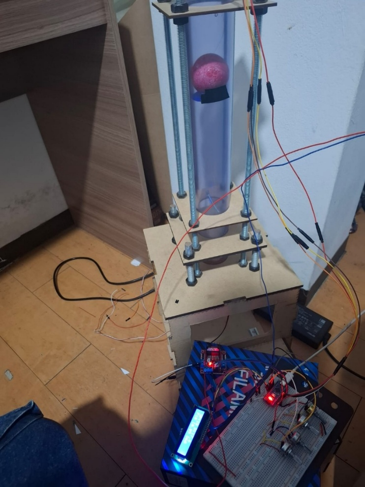

---

## My Contribution

This project was developed as part of a team.

My main responsibility was the **development of the control system, from the mathematical foundation to its implementation on the physical prototype**.

My work included:

- Mathematical modelling of the pneumatic plant
- Development of the control-system model
- Transfer-function analysis
- PID controller design
- MATLAB simulation
- Frequency-domain analysis
- Stability analysis
- Comparison of P, PI and PID controllers
- Controller tuning
- Transition from simulation to physical implementation
- Experimental adjustment of the controller
- Validation of the controller on the real prototype

This project allowed me to work through the complete control-engineering process from theoretical analysis to real hardware implementation.

---

## System Architecture

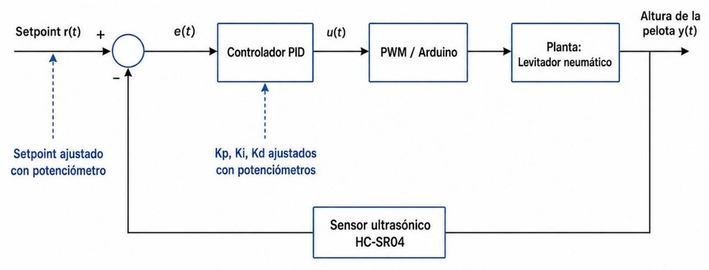

The closed-loop control architecture is:

**Setpoint → PID Controller → PWM → L298N Driver → DC Fan → Pneumatic Plant → Ball Position → HC-SR04 → Feedback**

The measured position is continuously compared with the desired position, allowing the controller to compensate for position errors.

---

## Hardware

The physical system integrates:

- Arduino Nano
- HC-SR04 ultrasonic sensor
- DC fan
- L298N motor driver
- Four potentiometers
- I2C LCD display
- DC-DC voltage regulator
- Protoboard
- Jumper wires
- Vertical pneumatic tube
- Polystyrene ball
- Mechanical support structure

### Arduino Connections

| Component | Arduino Pin |
|---|---|
| Setpoint potentiometer | A0 |
| Kp potentiometer | A1 |
| Ki potentiometer | A2 |
| Kd potentiometer | A3 |
| HC-SR04 TRIG | D2 |
| HC-SR04 ECHO | D3 |
| L298N ENA / PWM | D6 |
| L298N IN1 | D7 |
| L298N IN2 | D8 |

### Electrical Diagram

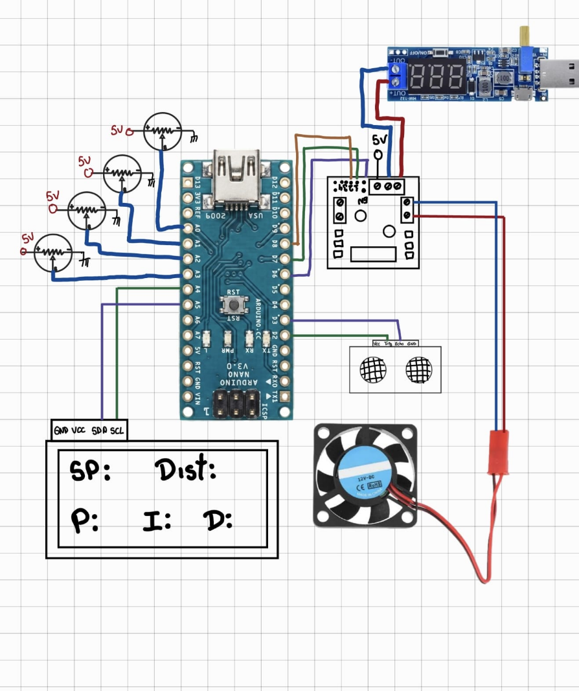

### Electronics Implementation

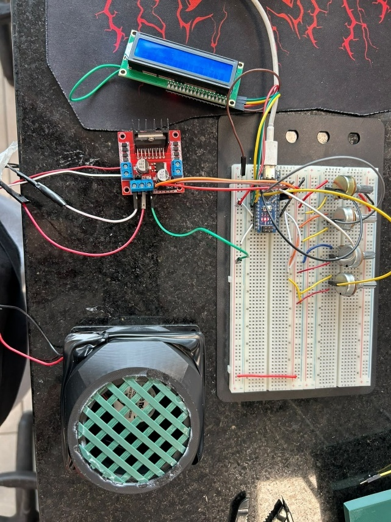

---

## Mathematical Modelling

The pneumatic levitation system was represented using an equivalent second-order mathematical model.

The model was developed from the vertical dynamics of the levitated ball around an operating point.

The equivalent plant used for the control analysis was:

**G(s) = 20 / (s² + 2s + 20)**

The mathematical model was used to:

- Analyze the dynamic behaviour of the plant
- Evaluate stability
- Study the open-loop response
- Design the PID controller
- Perform MATLAB simulations
- Analyze the system in the frequency domain

The real pneumatic system presents nonlinear behaviour, therefore the mathematical model represents an approximation of the physical plant.

---

## Open-Loop Analysis

Before implementing the PID controller, the uncontrolled plant was analyzed.

The open-loop response showed an oscillatory transient behaviour before reaching steady state.

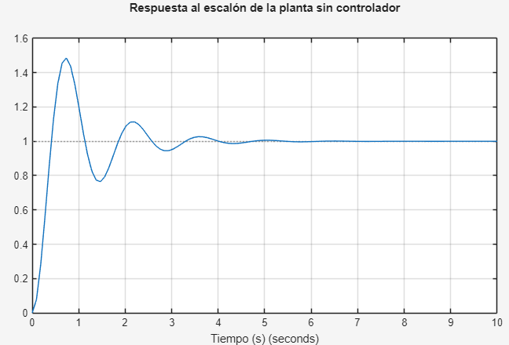

The system was also analyzed in the frequency domain using a Bode diagram.

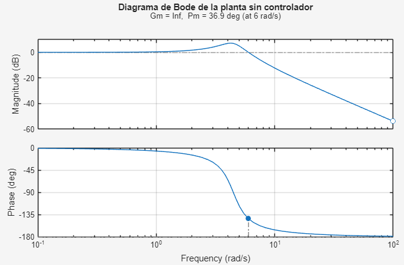

This analysis provided the basis for the theoretical controller design.

---

## PID Controller Design

A PID controller was designed to improve the dynamic behaviour of the pneumatic levitation system.

The main control objectives were:

- Improve stability
- Reduce oscillations
- Improve damping
- Improve reference tracking
- Reduce steady-state error
- Compensate for disturbances

The PID controller combines three control actions:

- **Proportional action:** reacts to the current control error
- **Integral action:** reduces accumulated and steady-state error
- **Derivative action:** reacts to changes in the error and improves damping

The controller was first analyzed and simulated in MATLAB.

After the theoretical stage, the controller was implemented on the physical prototype and experimentally adjusted.

---

## Stability Analysis

The controlled system was evaluated using classical control-system techniques.

The analysis included:

- Transfer-function analysis
- Routh-Hurwitz stability criterion
- Step-response analysis
- Frequency-domain analysis
- Bode diagrams
- Phase-margin evaluation

The theoretical analysis indicated stable closed-loop behaviour.

---

## Simulated Closed-Loop Performance

The controlled system was evaluated using a simulated reference of **30 cm**.

| Performance Metric | Result |
|---|---:|
| Reference | 30 cm |
| Rise time | 5.62 s |
| Settling time | 11.13 s |
| Overshoot | 0 % |
| Final value | 30 cm |
| Steady-state error | 0 cm |

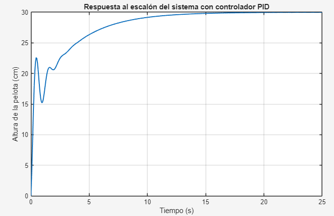

The controlled system was also evaluated in the frequency domain.

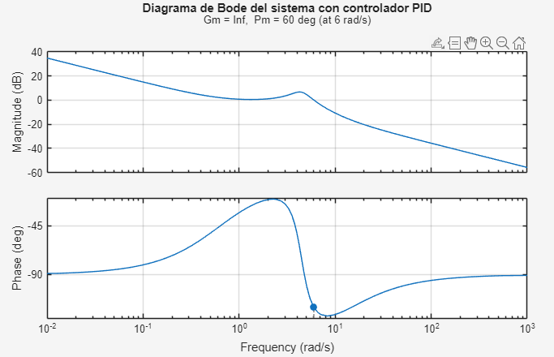

---

## P, PI and PID Comparison

Different classical control strategies were compared during the development of the project.

| Controller | Observed Behaviour |
|---|---|
| P | Fast response but presents error and oscillations |
| PI | Reduces permanent error but may increase oscillations |
| PID | Improves stability, precision and damping |

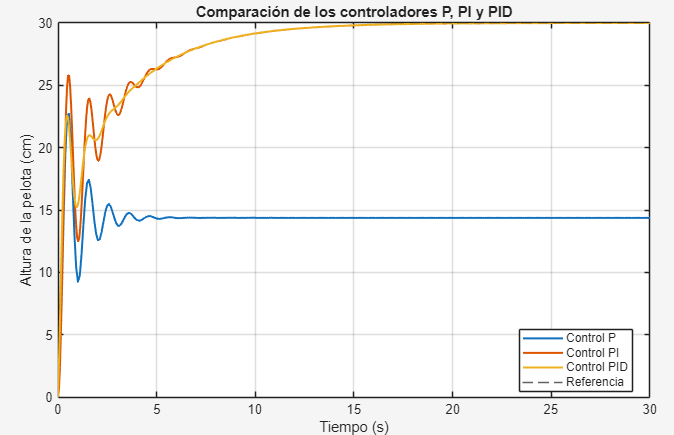

The PID controller provided the best overall balance between stability, precision and transient behaviour and was therefore selected for the final implementation.

---

## Embedded Control Implementation

The controller was implemented on an **Arduino Nano**.

The real-time control loop performs the following sequence:

1. Read the desired setpoint
2. Read the PID parameters
3. Measure the ball position using the HC-SR04
4. Calculate the position error
5. Calculate the PID control action
6. Limit the control output
7. Generate the PWM command
8. Apply the PWM signal to the DC fan
9. Display system variables on the LCD
10. Send operating data to the Serial Plotter
11. Repeat the control loop continuously

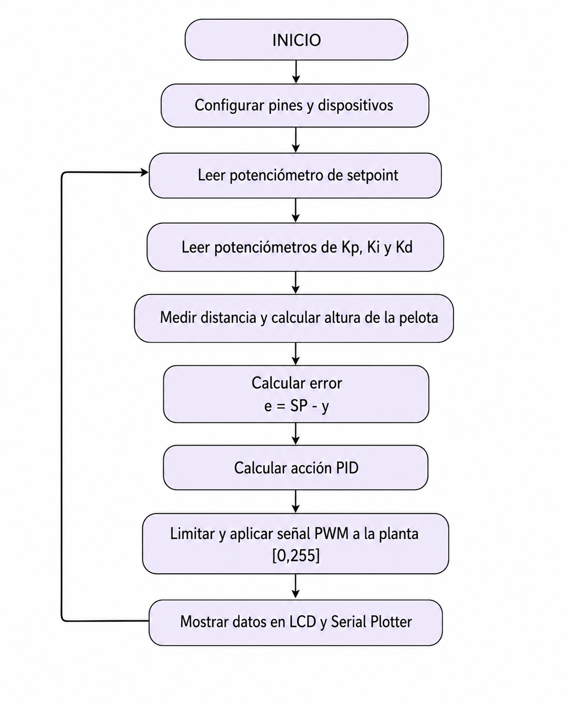

The Arduino source code is available here:

[`arduino/pneumatic_levitation_pid.ino`](arduino/pneumatic_levitation_pid.ino)

---

## Mechanical Design

The mechanical structure of the prototype was designed using **Autodesk Inventor**.

The design included:

- Vertical tube
- Upper tube support
- Lower tube support
- Fan adapter
- Structural rods
- Base structure
- Complete system assembly

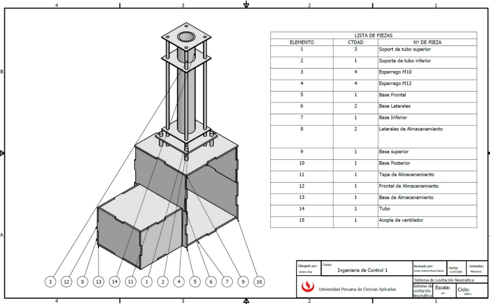

The mechanical design was later manufactured and integrated with the electronic and control systems.

---

## Experimental Tuning

The theoretical controller provided an initial design, but the real pneumatic plant presented effects that were not completely represented by the mathematical model.

These included:

- Nonlinear airflow
- Turbulence inside the tube
- Ultrasonic sensor noise
- Lateral movement of the ball
- Fan limitations
- PWM saturation

Because of these effects, the controller parameters required experimental adjustment after implementation on the physical prototype.

This stage was particularly important because it demonstrated the difference between theoretical controller design and real-world control-system behaviour.

---

## Experimental Validation

The PID controller was validated on the physical pneumatic levitation system.

During the experimental test, a reference of approximately **23.64 cm** was established.

During the stable operating interval, the ball position remained approximately between:

**23.56 cm and 23.66 cm**

Despite turbulence, ball movement and ultrasonic measurement variations, the controller maintained the ball close to the desired reference.

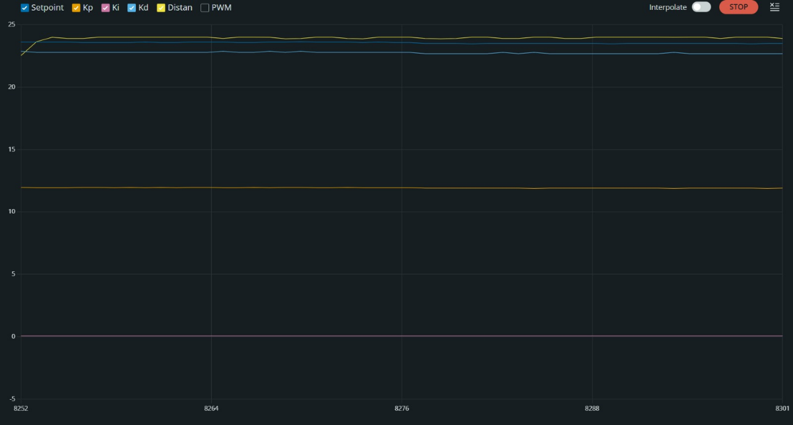

---

## PWM Behaviour

The PWM command continuously changed to compensate for variations in ball position.

During stable operation, the PWM output remained mainly between:

**240 and 245**

The controller occasionally reached the maximum PWM value of:

**255**

when larger deviations occurred.

This behaviour showed how the controller continuously adjusted the fan power to recover the desired position after disturbances.

---

## MATLAB Analysis

The repository contains MATLAB scripts that reproduce the main control-system analysis performed during the project.

### Plant Model

[`matlab/plant_model.m`](matlab/plant_model.m)

Includes:

- Plant transfer function
- Open-loop step response
- Open-loop frequency response
- Dynamic analysis

### PID Design

[`matlab/pid_design.m`](matlab/pid_design.m)

Includes:

- PID controller definition
- Closed-loop system
- Frequency response
- Step response
- Performance evaluation
- Stability verification

### Controller Comparison

[`matlab/controller_comparison.m`](matlab/controller_comparison.m)

Includes:

- P controller
- PI controller
- PID controller
- Step-response comparison
- Performance comparison
- Closed-loop pole analysis

---

## Repository Structure

    pneumatic-levitation-pid/
    │
    ├── README.md
    │
    ├── arduino/
    │   └── pneumatic_levitation_pid.ino
    │
    ├── matlab/
    │   ├── plant_model.m
    │   ├── pid_design.m
    │   └── controller_comparison.m
    │
    └── images/
        ├── system_block_diagram.jpeg
        ├── prototype.jpeg
        ├── electrical_diagram.png
        ├── electronics_implementation.jpeg
        ├── cad_assembly.png
        ├── open_loop_response.png
        ├── open_loop_bode.png
        ├── closed_loop_response.png
        ├── closed_loop_bode.png
        ├── controller_comparison.png
        ├── experimental_response.png
        └── control_flowchart.png

---

## Engineering Skills Demonstrated

- Control Systems
- PID Control
- MATLAB
- Mathematical Modelling
- Arduino
- Embedded Control
- Sensors and Instrumentation
- PWM Control
- Frequency-Domain Analysis
- Stability Analysis
- Experimental Testing
- Hardware Integration
- System Validation
- Troubleshooting
- Autodesk Inventor
- Model-to-Hardware Implementation

---

## Key Engineering Challenges

### Model vs. Physical Plant

The mathematical model provided a useful starting point, but the real pneumatic system introduced nonlinearities and disturbances that required additional experimental tuning.

### Sensor Noise

The HC-SR04 measurements presented variations caused by ultrasonic reflections and ball movement.

### Pneumatic Disturbances

Air turbulence inside the tube continuously affected the ball position.

### Actuator Saturation

The fan required relatively high PWM values during operation and occasionally reached the PWM saturation limit.

### Model-to-Hardware Transition

The theoretical controller had to be adjusted after implementation on the real system.

---

## Code Provenance

This repository is based on the original academic project and its documented experimental results.

The Arduino source code was transcribed and cleaned from the implementation documented in the original project report.

The MATLAB scripts were reconstructed from the mathematical modelling and control analysis developed during the original project because the original MATLAB source files were no longer available.

The reconstructed scripts are included to make the engineering methodology reproducible and transparent.

---

## Future Improvements

Possible improvements include:

- Digital filtering of ultrasonic measurements
- Improved experimental plant identification
- Higher-precision position sensing
- Automatic PID tuning
- Experimental data logging
- Direct comparison between simulated and experimental responses
- Improved anti-windup strategy
- Hardware-in-the-loop testing
- Software-in-the-loop testing
- Alternative control strategies
- CAN-based data acquisition
- Real-time telemetry
- Improved actuator sizing

---

## Conclusion

This project demonstrates the development of a complete closed-loop control system from mathematical modelling to physical implementation.

The complete engineering workflow was:

**Model → Analyze → Design → Simulate → Implement → Tune → Test → Validate**

The final prototype demonstrated stable pneumatic levitation and provided practical experience with the challenges involved in transferring a theoretical control-system design to real hardware.
